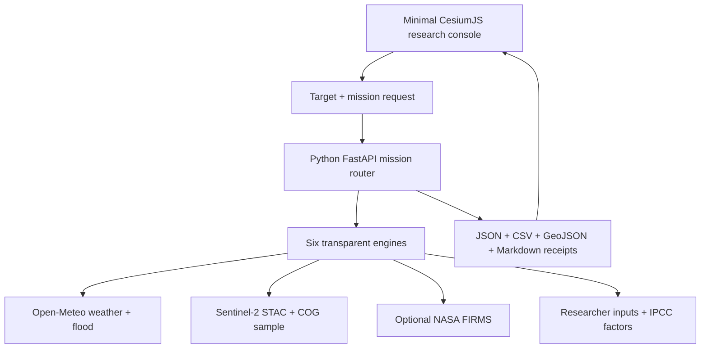

# AgriScope Earth 3D

AgriScope Earth is a global, full-stack agricultural and environmental screening platform. A minimalist CesiumJS interface keeps a real 3D Earth at the centre, while a Python FastAPI service runs six transparent research missions and returns sources, evidence status, caveats and exportable receipts.

This repository is the complete application—not the earlier Streamlit interface and not a static mock-up.

## What is included

- real rotatable CesiumJS WGS84 globe;
- keyless satellite, dark and OpenStreetMap basemaps with visible attribution;
- optional Cesium World Terrain using a public domain-restricted ion token;
- worldwide place search and click-to-target interaction;
- target-local animated research graphics with no decorative intercontinental links;
- six agricultural/environmental engines;
- live Open-Meteo weather and flood data;
- Sentinel-2 L2A STAC/COG sampling in the Python engine;
- optional NASA FIRMS near-real-time detections;
- stale-result protection when a target or input changes;
- source receipts, evidence status, methods, caveats and session history;
- JSON, CSV, GeoJSON and Markdown exports;
- responsive, accessible, progressively disclosed interface;
- tests, Docker backend, Render blueprint and GitHub Actions.

## Six research missions

| ID | Mission | Main evidence | Important interpretation |
|---|---|---|---|
| M01 | Flood & crop exposure | GloFAS/Open-Meteo discharge + rain | Screening exposure, not flood depth or crop loss. |
| M02 | Crop stress | Sentinel-2 NDVI/NDMI + weather | Inspection priority, not disease diagnosis. |
| M03 | Wetland & land-use change | Researcher-validated class summaries | Identical summaries give identical results; coordinates only anchor the study. |
| M04 | Irrigation intelligence | FAO ET₀ + rain + system inputs | Seven-day water/energy screen, not a complete soil-water schedule. |
| M05 | Agricultural carbon | Activity data + IPCC Tier 1 factors | Identical activities give identical values; location alone is not an emission factor. |
| M06 | Fire & heat | Weather + optional NASA FIRMS | Thermal anomalies are not automatically agricultural fires. |

## Architecture



The frontend also contains an explicitly labelled live browser calculation so the public interface remains useful if the Python host is not configured or temporarily asleep. It never labels browser output as Python output. Sentinel processing and live FIRMS remain backend capabilities.

## Quick start

Requirements: Node.js 22.13+ and Python 3.11+ (3.12 recommended).

### 1. Start the Python API

```bash
cd backend
python -m venv .venv
```

Activate it:

```bash
# Windows PowerShell
.venv\Scripts\Activate.ps1

# macOS/Linux
source .venv/bin/activate
```

Then install and run:

```bash
pip install -r requirements.txt
uvicorn app.main:app --reload --port 8000
```

API health: `http://localhost:8000/api/v1/health`  
Interactive API docs: `http://localhost:8000/docs`

### 2. Start the 3D web client

From the repository root:

```bash
cp .env.example .env.local
npm ci
npm run dev
```

On Windows, copy `.env.example` to `.env.local` manually. The default local frontend automatically checks `http://localhost:8000`.

`npm run dev` prepares the Cesium Workers, Assets, ThirdParty and Widgets folders before starting the application.

## Environment variables

### Frontend (`.env.local`)

| Variable | Required | Purpose |
|---|---:|---|
| `VITE_API_BASE_URL` | Production: yes | Public FastAPI origin, for example `https://agriscope-api.onrender.com`. |
| `VITE_CESIUM_ION_TOKEN` | For terrain | Public, scoped and domain-restricted Cesium ion token. Satellite imagery works without it. |

### Backend (`backend/.env` or host dashboard)

| Variable | Required | Purpose |
|---|---:|---|
| `CORS_ORIGINS` | Production: yes | Exact comma-separated frontend origins. |
| `FIRMS_MAP_KEY` | Optional | Enables live VIIRS detections in M06. Never expose in frontend code. |
| `SENTINEL_MAX_SAMPLE_HECTARES` | No | Bounds COG sampling; default 2,500 ha. |

Never commit `.env.local`, `backend/.env`, keys or tokens.

## Deployment

The frontend and Python API are separate services. The repository includes a
complete GitHub-to-public path for the valid custom domain
`https://agriscope-earth-v3.site`:

1. Push this complete repository to GitHub.
2. Deploy `backend/` to Render with the included `render.yaml`.
3. Import the same GitHub repository into Cloudflare Workers Builds.
4. Use `npm ci && npm run build` as the build command.
5. Use `npm run deploy:cloudflare` as the deploy command.
6. Connect the purchased custom domain in Cloudflare.
7. Verify the top status reads **Python API**.

An underscore cannot be used in a website hostname, so
`agriscope-earth_v3.site` is intentionally normalized to
`agriscope-earth-v3.site`.

Detailed beginner-friendly instructions are in the
[GitHub-to-public deployment guide](docs/DEPLOYMENT.md).

## Scientific integrity

The 0–100 value is a **screening priority**, not a probability, model accuracy, official warning, diagnosis or measured loss. `confidence` in the API schema is displayed as evidence completeness; it is a rule-based traceability indicator, not a statistical confidence interval.

Every result records:

- unique analysis ID and UTC generation time;
- coordinates, area and mission parameters;
- methodology version;
- evidence status;
- metrics with units and interpretation;
- source provider, identifiers/dates when available and data role;
- limitations and research-use boundaries.

Animated rings, dots, spokes and columns are target-local analysis graphics. They are not observed flood, fire, field, carbon or land-change geometry unless a cited source explicitly returns that geometry.

Read before research use:

- [User guide](docs/USER_GUIDE.md)
- [Methodology](docs/METHODOLOGY.md)
- [Data sources](docs/DATA_SOURCES.md)
- [Scientific validation](docs/SCIENTIFIC_VALIDATION.md)
- [Results and globe troubleshooting](docs/RESULTS_AND_MAP_TROUBLESHOOTING.md)

## Tests

Frontend source checks:

```bash
npx eslint app components/agriscope lib/agriscope
```

Backend tests:

```bash
cd backend
pip install -r requirements-dev.txt
pytest -q
```

GitHub Actions runs both on pushes and pull requests.

## API endpoints

| Method | Path | Purpose |
|---|---|---|
| GET | `/api/v1/health` | Version, methodology and provider configuration. |
| GET | `/api/v1/missions` | Six mission definitions. |
| GET | `/api/v1/geocode?q=...` | Worldwide place search. |
| POST | `/api/v1/analyze` | Execute one mission. |
| POST | `/api/v1/export` | Server-side JSON, CSV or GeoJSON export. |

## Licence and attribution

Application code is MIT licensed. Upstream datasets, satellite imagery, basemaps and terrain retain their own licences and attribution requirements. Keep the on-globe credits visible and cite the exact upstream products recorded in each research receipt.

This interface is an original agricultural research design. It does not copy another repository's source code or branded assets.
